# Proyecto Integrador ElectroCasa

Este repositorio contiene el desarrollo del proyecto integrador de ElectroCasa. El caso plantea una cadena de electrodomésticos con información distribuida en varias fuentes y sin un proceso centralizado para integrar los datos.

Para resolverlo implementé una plataforma de datos en Databricks usando una arquitectura Medallion. La idea fue mantener los datos originales en Bronze, realizar la limpieza y estandarización en Silver y dejar en Gold los resultados que sirven para responder las preguntas principales del negocio.

Además de la transformación de datos, el proyecto incluye ingesta desde archivos y Azure SQL, controles de calidad, cuarentena de registros rechazados, historización de empleados, orquestación con Lakeflow Jobs, gobierno con Unity Catalog y despliegue mediante Databricks Asset Bundles.

---

## 1. Objetivo del proyecto

El objetivo es centralizar las seis fuentes entregadas para el caso ElectroCasa y dejar un flujo reproducible E2E.

Las fuentes utilizadas son:

| Fuente | Formato / origen | Forma de llegada |
|---|---|---|
| Ventas por sucursal | CSV | Diaria e incremental |
| Catálogo de productos | JSON | Snapshot de baja frecuencia |
| Empleados de RR.HH. | CSV | Eventos por lote |
| Reseñas de clientes | JSON semiestructurado | Incremental |
| Devoluciones | CSV | Diaria e incremental |
| Tracking de envíos | Azure SQL Database | Consulta bajo demanda |

Las principales preguntas que busqué responder en la capa Gold fueron:

- cuánto vende cada sucursal por mes y cuál es su ticket promedio;
- qué productos tienen mayor cantidad de ventas y devoluciones;
- cuál es la dotación activa de empleados por sucursal;
- qué categorías presentan una mayor tasa de reseñas negativas;
- cómo se distribuyen los envíos por courier y estado.

---

## 2. Estructura del repositorio

La estructura del proyecto quedó separada de esta manera:

```text
electrocasa-lakehouse/
├── databricks.yml
├── resources/
│   ├── electrocasa_pipeline.yml
│   └── electrocasa_job.yml
├── src/
│   └── electrocasa/
│       ├── transformations/
│       │   ├── bronze.py
│       │   ├── silver.py
│       │   └── gold.py
│       └── utils/
├── notebooks/
│   ├── 00_setup.ipynb
│   ├── 01_ingest_files.py
│   └── 02_apply_governance.py
├── sql/
│   ├── 01_create_azure_sql_connection.sql
│   └── 02_validation_queries.sql
├── data/
├── docs/
│   └── evidence/
└── README.md
```

`00_setup.ipynb` se utiliza antes del despliegue para preparar Unity Catalog, los schemas, el Volume de landing y los permisos. Los recursos del pipeline y del job se encuentran en `resources/`, mientras que las transformaciones Bronze, Silver y Gold están separadas dentro de `src/electrocasa/transformations/`.

---

## 3. Arquitectura implementada

El flujo general quedó de la siguiente manera:

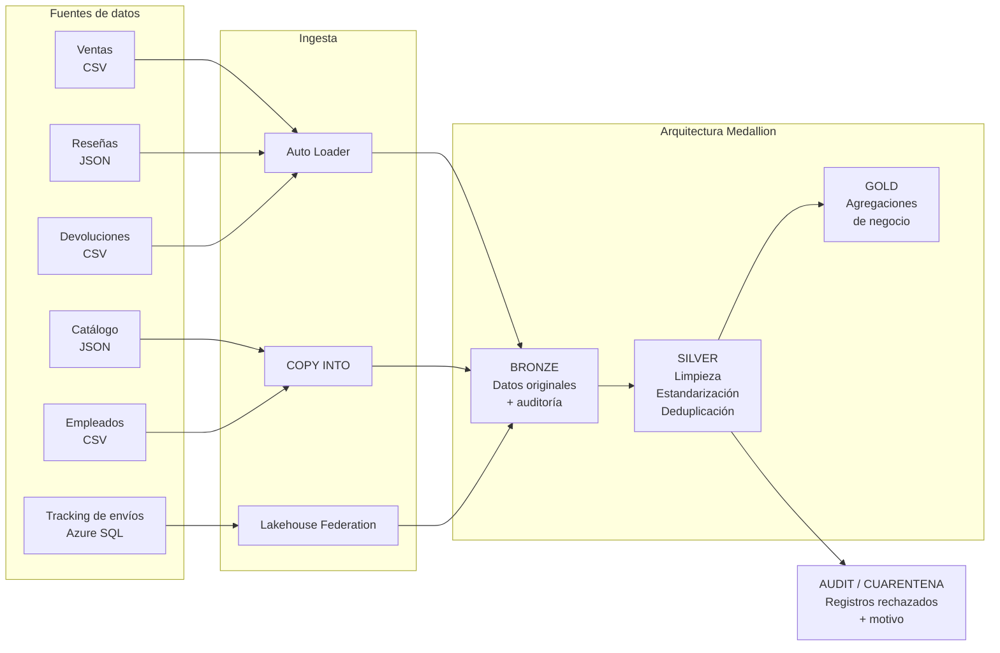

En Bronze mantengo los datos lo más cercanos posible a la fuente y agrego información técnica como fecha de ingesta, archivo o sistema de origen e identificador de lote.

En Silver se realizan las transformaciones necesarias para que los datos sean utilizables: conversión de tipos, normalización de valores, deduplicación, reglas de calidad e historización de empleados.

Gold contiene las agregaciones finales y evita que el usuario tenga que volver a interpretar los datos raw para responder las preguntas del caso.

---

## 4. Métodos de ingesta

No utilicé un único mecanismo para todas las fuentes porque tienen comportamientos diferentes.

### 4.1 Auto Loader

Utilicé Auto Loader para:

- ventas;
- reseñas;
- devoluciones.

Estas fuentes fueron tratadas como incrementales. En este caso Auto Loader permite procesar nuevos archivos sin volver a leer todo el histórico en cada ejecución.

Tanto `schemaLocation` como `checkpointLocation` se almacenan dentro del Volume del proyecto:

```text
/Volumes/<catalogo>/bronze/landing/_schemas/
/Volumes/<catalogo>/bronze/landing/_checkpoints/
```

De esta manera el estado de la ingesta no depende de almacenamiento temporal del compute.

### 4.2 COPY INTO

Utilicé `COPY INTO` para:

- catálogo de productos;
- empleados de RR.HH.

El catálogo corresponde a un snapshot de baja frecuencia y los empleados llegan como eventos por lote. Para estas dos fuentes preferí una carga simple por archivo.

Otra razón para usar `COPY INTO` es la idempotencia de la carga: al volver a ejecutar el proceso sobre el mismo archivo, Databricks conserva el seguimiento de los archivos que ya fueron procesados y evita volver a cargarlos como una nueva ingesta.

### 4.3 Tracking de envíos desde Azure SQL

El tracking no se carga desde el archivo `.sql` incluido entre los insumos. Ese archivo se conserva únicamente como referencia del dataset.

La fuente utilizada por el proyecto es la tabla:

```text
dbo.TrackingEnvios
```

ubicada en Azure SQL Database.

Para consumirla utilicé Lakehouse Federation mediante una conexión SQL Server de Unity Catalog y un catálogo federado llamado:

```text
electrocasa_sql
```

En el pipeline solo se seleccionan las columnas que se necesitan:

```text
tracking_id
pedido_id
courier
estado_entrega
sucursal_origen
fecha_actualizacion
```

Las credenciales no están escritas en el código ni en este repositorio. El usuario y la contraseña se almacenan en el Secret Scope `electrocasa_sql`.

---

## 5. Exploración y problemas encontrados

Antes de transformar los datos revisé los archivos entregados para identificar qué problemas había que resolver realmente.

En ventas se encontraron 15,225 filas para 15,000 identificadores de venta distintos. También aparecen métodos de pago escritos de diferentes formas, fechas en más de un formato, sucursales faltantes y montos nulos, cero o negativos.

El catálogo contiene 3,030 registros para 3,000 productos distintos. Algunos precios llegan con el prefijo `S/`, existen precios no positivos, marcas nulas y categorías escritas con diferentes combinaciones de mayúsculas, minúsculas y tildes.

En empleados se tienen 4,078 eventos correspondientes a 2,000 `id_empleado`. Esto ocurre porque una persona puede aparecer varias veces debido a altas, transferencias, cambios de salario o bajas. También hay DNI nulos, DNI asociados a más de un identificador de empleado y eventos sin fecha.

Las reseñas contienen 8,080 filas para 8,000 identificadores distintos. Se encontraron calificaciones fuera del rango permitido, valores nulos, comentarios vacíos, `tags` nulos y productos que no aparecen en el catálogo.

En devoluciones se tienen 4,040 filas para 4,000 identificadores distintos. Entre los problemas encontrados están montos de reembolso negativos, motivos vacíos, pedidos faltantes y referencias de producto que no existen en el catálogo.

Finalmente, el tracking contiene estados con diferentes nombres o formatos, por ejemplo `Entregado`, `ENTREGADO`, `En camino`, `EN_CAMINO` y `en_transito`. También presenta diferencias de escritura en el nombre del courier y registros reingestados.

---

## 6. Capa Bronze

La capa Bronze conserva la información de las seis fuentes antes de aplicar reglas de negocio.

Las tablas principales son:

```text
bronze.ventas
bronze.catalogo_productos
bronze.empleados
bronze.resenas
bronze.devoluciones
bronze.tracking_envios
```

Para mantener trazabilidad se agregan columnas técnicas como:

```text
_ingested_at
_source_file
_batch_id
```

En el caso de tracking, `_source_file` identifica a Azure SQL como sistema de origen.

La intención de Bronze es que, incluso si un registro es inválido para Silver, siga existiendo una copia del dato recibido desde la fuente.

---

## 7. Capa Silver y reglas de calidad

En Silver se aplican la limpieza, estandarización y deduplicación.

Las reglas de calidad que implementé fueron:

| Fuente | Regla aplicada | Política |
|---|---|---|
| Ventas | `monto_total > 0` | Descartar de Silver |
| Catálogo | `precio_lista > 0` | Descartar de Silver |
| Empleados | `dni IS NOT NULL` | Descartar de Silver |
| Reseñas | `calificacion BETWEEN 1 AND 5` | Descartar de Silver |
| Devoluciones | `monto_reembolso >= 0` | Descartar de Silver |
| Tracking | estado dentro del conjunto permitido | Descartar de Silver |

Decidí aplicar una política de descarte en Silver porque esos valores no son confiables para las métricas posteriores. Por ejemplo, una venta con importe negativo alteraría directamente el total vendido y una reseña con calificación 0 o 6 no pertenece a la escala definida.

El descarte no significa que el dato desaparezca. Bronze conserva la información original y adicionalmente se genera una cuarentena consultable para poder revisar qué fue rechazado.

---

## 8. Cuarentena y trazabilidad

Los registros que no cumplen las reglas principales se registran en:

```text
audit.cuarentena
```

La cuarentena guarda:

```text
fuente
motivo_rechazo
origen
registro_json
fecha_procesamiento
```

Esto permite revisar qué dato fue rechazado, de dónde vino y cuál fue la razón. Preferí manejarlo de esta manera para no perder trazabilidad y poder analizar el problema posteriormente sin contaminar las tablas Silver.

---

## 9. Historización de empleados

La fuente de RR.HH. no representa únicamente el estado actual del empleado. Un mismo empleado puede tener varios eventos debido a transferencias, cambios salariales y bajas.

Por ese motivo implementé una historización tipo 2 derivada de los eventos recibidos.

La tabla:

```text
silver.empleados_historial
```

mantiene, entre otros, los campos:

```text
dni
id_empleado
sucursal_id
cargo
salario
tipo_evento
vigente_desde
vigente_hasta
es_actual
```

`vigente_desde` indica cuándo comienza una versión y `vigente_hasta` contiene el inicio de la siguiente versión como límite exclusivo. `es_actual` permite identificar la última versión disponible.

El DNI se utiliza como clave de negocio después de validar que no sea nulo. Si un mismo DNI aparece relacionado con más de un `id_empleado`, lo considero ambiguo y no lo incorporo al historial confiable; esos casos quedan disponibles en la cuarentena.

La fuente solo incluye fecha y no una hora o secuencia exacta de los eventos. Por ese motivo, si dos cambios del mismo empleado ocurrieran el mismo día, no es posible conocer con total certeza cuál ocurrió primero. El código utiliza un criterio técnico estable para mantener una ejecución reproducible, pero no intenta inventar una secuencia que la fuente no proporciona.

---

## 10. Capa Gold

La capa Gold contiene las tablas utilizadas para responder las preguntas del negocio.

### `gold.ventas_sucursal_mes`

Agrupa las ventas por sucursal y mes y calcula:

```text
ventas_total
cantidad_ventas
ticket_promedio
```

### `gold.productos_desempeno`

Combina ventas, devoluciones y catálogo para obtener:

```text
unidades_vendidas
monto_vendido
cantidad_devoluciones
monto_reembolsado
ranking_ventas
ranking_devoluciones
```

### `gold.dotacion_activa_sucursal`

Cuenta la cantidad de trabajadores que tienen una versión vigente y cuyo último evento no corresponde a una baja.

### `gold.resenas_negativas_categoria`

Calcula el total de reseñas, las reseñas negativas y la tasa de reseñas negativas por categoría. Para este proyecto consideré como negativas las calificaciones 1 y 2.

### `gold.estado_envios`

Resume la cantidad de envíos agrupados por courier y estado estandarizado.

---

## 11. Orquestación

La ejecución se encuentra definida en `resources/electrocasa_job.yml`.

El job tiene tres tareas con dependencias reales:

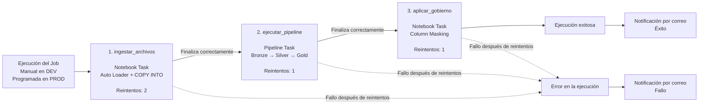

`ingestar_archivos` ejecuta el notebook que utiliza Auto Loader y `COPY INTO`.

`ejecutar_pipeline` ejecuta el Lakeflow Declarative Pipeline encargado de Bronze, Silver, Gold y Audit.

`aplicar_gobierno` aplica el masking sobre los campos sensibles una vez creados los objetos del pipeline.

Por lo tanto, el job utiliza dos tipos de tarea: `notebook_task` y `pipeline_task`.

También se configuraron reintentos. La primera tarea permite dos reintentos y las dos siguientes permiten un reintento. Entre intentos existe un intervalo de 60 segundos.

El job envía notificaciones de éxito y error al correo indicado mediante la variable `alert_email`.

La programación de producción quedó configurada diariamente a las 06:00 con zona horaria `America/Lima`. En desarrollo la programación permanece pausada para poder hacer las pruebas de manera controlada.

---

## 12. Databricks Asset Bundle

El proyecto se despliega mediante un Databricks Asset Bundle.

El archivo `databricks.yml` se encuentra en la raíz y los recursos se declaran por separado dentro de `resources/`.

Se definieron dos targets:

| Target | Catálogo | Programación |
|---|---|---|
| `dev` | `electrocasa_dev` | Pausada |
| `prod` | `electrocasa_prod` | Activa |

Esto permite probar el proyecto en un catálogo de desarrollo antes de desplegar la misma definición hacia producción.

Los comandos utilizados son:

```bash
databricks bundle validate -t dev --var="alert_email=CORREO_REAL"
databricks bundle deploy -t dev --var="alert_email=CORREO_REAL"
databricks bundle run -t dev --var="alert_email=CORREO_REAL" electrocasa_job
```

Para producción:

```bash
databricks bundle validate -t prod --var="alert_email=CORREO_REAL"
databricks bundle deploy -t prod --var="alert_email=CORREO_REAL"
databricks bundle run -t prod --var="alert_email=CORREO_REAL" electrocasa_job
```

El correo real no se deja fijo dentro del repositorio. Se entrega al bundle mediante la variable `alert_email` durante el despliegue.

---

## 13. Gobierno y seguridad

Para separar responsabilidades se crearon tres grupos:

| Grupo | Acceso |
|---|---|
| `electrocasa_ingenieria` | Lectura y escritura sobre las capas del proyecto |
| `electrocasa_analistas` | Solo lectura sobre Gold |
| `electrocasa_auditoria` | Lectura de Gold y del schema Audit |

Los permisos se aplican mediante `GRANT` desde `00_setup.ipynb`.

Los campos `dni` y `salario` de empleados fueron considerados sensibles. Sobre `silver.empleados_historial` se aplican column masks para que solamente los integrantes de `electrocasa_ingenieria` puedan visualizar el valor real.

Las tablas creadas por el pipeline son managed tables/materialized views porque su ciclo de vida forma parte del propio proyecto. Los archivos raw se mantienen dentro de un Volume gobernado por Unity Catalog. No creé external tables porque en este ejercicio no se entregó una ubicación de almacenamiento externo que tuviera que ser compartida o administrada de manera independiente al pipeline.

### Consideración de Free Edition

En Databricks Free Edition los account groups necesarios para Unity Catalog se crearon desde la interfaz de administración del workspace. Después de crearlos, `00_setup.ipynb` se encarga de crear los objetos del proyecto y ejecutar los permisos sobre esos grupos.

---

## 14. Monitoreo y costos

Para el monitoreo utilicé tanto el historial de ejecución del Job como el estado del Lakeflow Pipeline.

También se puede consultar el event log del pipeline:

```sql
SELECT
  timestamp,
  level,
  event_type,
  message
FROM event_log(TABLE(electrocasa_dev.gold.ventas_sucursal_mes))
ORDER BY timestamp DESC
LIMIT 100;
```

Esta consulta permite revisar eventos de ejecución y problemas encontrados durante el procesamiento.

El proyecto se ejecuta con serverless porque estoy trabajando en Databricks Free Edition. Para este caso resulta suficiente debido a que los archivos entregados tienen un volumen pequeño y el proceso está planteado como una ejecución diaria, no como un flujo que necesite compute encendido permanentemente.

También mantuve un único pipeline y un job con tareas secuenciales. De esta forma se evita mantener recursos ejecutándose cuando no son necesarios.

---

## 15. Pasos para desplegar el proyecto

Antes del despliegue se requiere:

1. Tener Databricks CLI autenticado contra el workspace.
2. Crear el Secret Scope `electrocasa_sql` con las claves `username` y `password`.
3. Crear y probar la conexión de Lakehouse Federation con Azure SQL.
4. Crear los grupos de Ingeniería, Analistas y Auditoría.
5. Ejecutar `notebooks/00_setup.ipynb`.
6. Subir los cinco archivos de entrada al Volume del catálogo correspondiente.
7. Validar el bundle.
8. Desplegar el target.
9. Ejecutar el job.
10. Revisar las tablas Silver, Gold, cuarentena y el historial de ejecución.

Para desarrollo los archivos se almacenan bajo:

```text
/Volumes/electrocasa_dev/bronze/landing/
```

con las carpetas:

```text
ventas/
catalogo/
empleados/
resenas/
devoluciones/
```

Tracking no se copia al Volume porque se consulta directamente desde Azure SQL.

---

# Evidencias de ejecución

Las siguientes capturas corresponden a la ejecución real del proyecto. Las imágenes se guardan en `docs/evidence/` para que también formen parte del repositorio.

> **Importante:** antes de la entrega final, todas las imágenes de esta sección deben corresponder a ejecuciones reales y exitosas. No se deben subir capturas que muestren contraseñas, tokens o credenciales.

## Evidencia 1 - Estructura del proyecto y repositorio GitHub

Esta captura permite verificar que el repositorio contiene la estructura solicitada y que el código del proyecto se encuentra versionado.

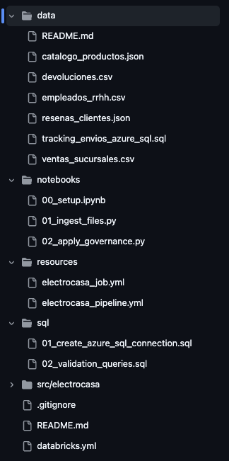

## Evidencia 2 - Aprovisionamiento en Unity Catalog

Se muestra el catálogo de desarrollo con sus schemas y el Volume utilizado como landing.

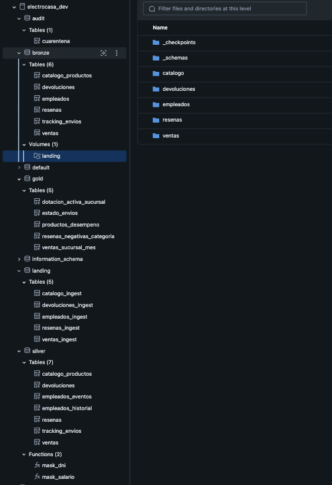

## Evidencia 3 - Conexión con Azure SQL

Consulta realizada sobre `electrocasa_sql.dbo.TrackingEnvios` utilizando Lakehouse Federation.

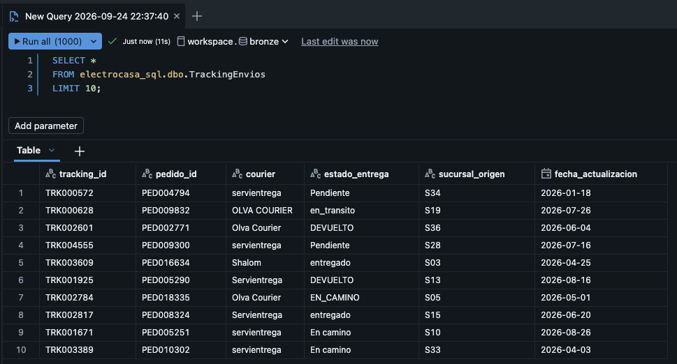

## Evidencia 4 - Ejecución del Lakeflow Declarative Pipeline

Vista del pipeline ejecutado correctamente, mostrando el flujo entre las tablas Bronze, Silver, Gold y Audit.

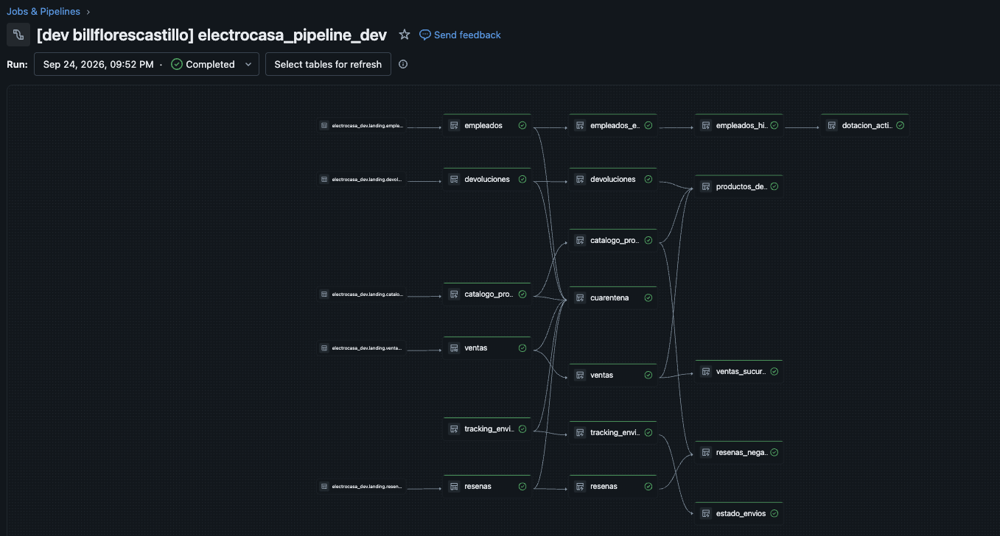

## Evidencia 5 - Calidad de datos

Detalle de las expectativas de calidad ejecutadas en el pipeline. La evidencia debe permitir observar que las reglas fueron evaluadas durante una ejecución real.

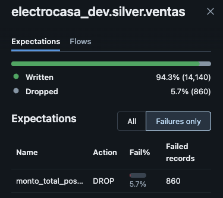

## Evidencia 6 - Cuarentena

Resultado de una consulta sobre `audit.cuarentena`, mostrando al menos la fuente, motivo del rechazo y fecha de procesamiento.

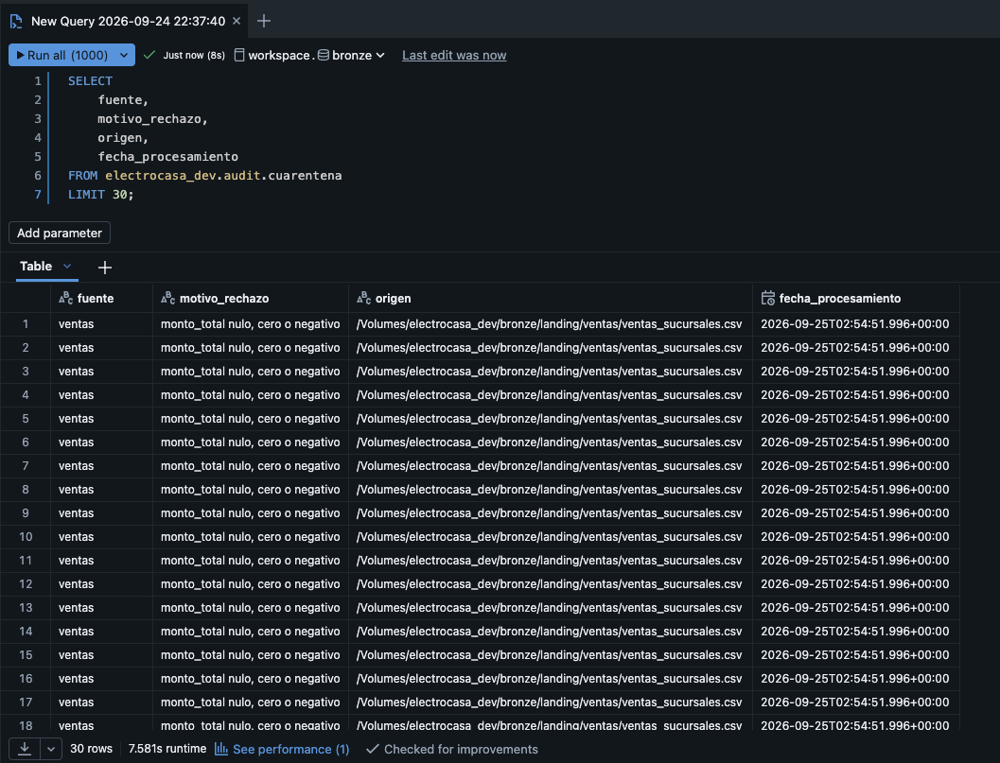

## Evidencia 7 - Resultados Gold

Resultado de las métricas principales de ventas por sucursal y mes.

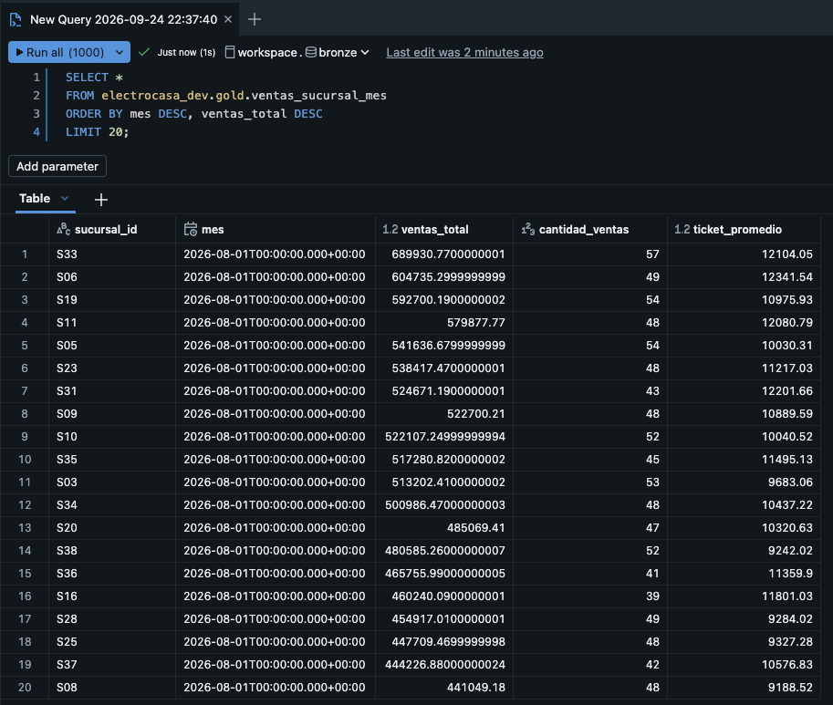

Resultado del desempeño de productos y devoluciones.

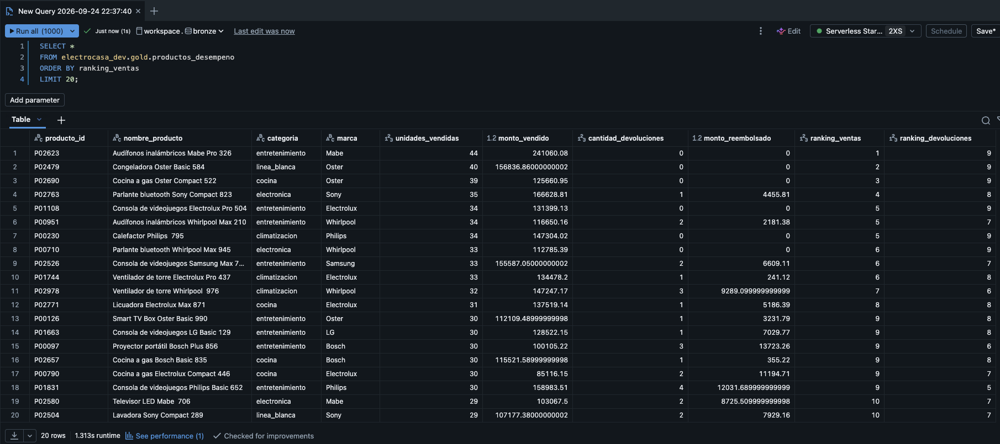

## Evidencia 8 - Job de orquestación

Vista de la ejecución completa del job donde se observen las tres tareas y su estado exitoso.

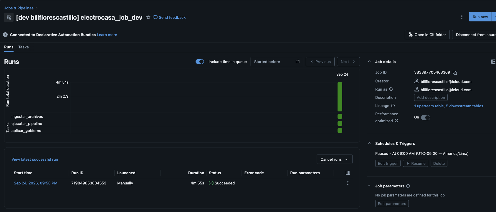

## Evidencia 9 - Databricks Asset Bundle en DEV

Validación y despliegue exitoso del target `dev`.

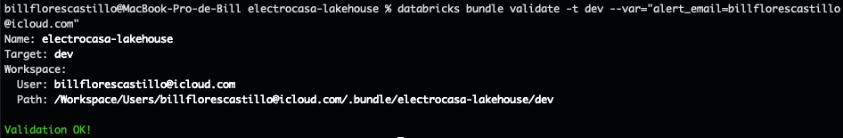

## Evidencia 10 - Databricks Asset Bundle en PROD

Validación y despliegue exitoso del target `prod`.


## Evidencia 11 - Monitoreo

Consulta del event log o historial de ejecución utilizada para revisar el comportamiento del pipeline.


## Evidencia 12 - Gobierno y seguridad

Evidencia de los grupos y permisos creados para el proyecto.


Evidencia de la protección aplicada sobre `dni` y `salario`.


---

## 16. Resultado final

Con este proyecto se integran las seis fuentes del caso ElectroCasa dentro de una misma arquitectura de datos. El flujo conserva los datos originales en Bronze, aplica controles y estandarización en Silver, mantiene trazabilidad de los registros rechazados y genera en Gold resultados directamente utilizables para análisis.

Además, el proyecto queda versionado en GitHub y puede desplegarse de forma reproducible en `dev` y `prod` mediante Databricks Asset Bundles. La orquestación y el gobierno también forman parte del mismo flujo, en lugar de quedar como pasos manuales separados.
